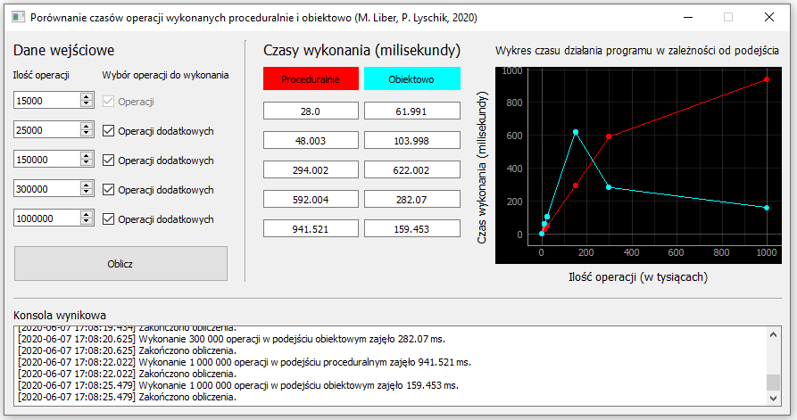

# Procedural vs Objective (2020)

### Opis

Aplikacja ma za zadanie pokazać różnicę w czasie wykonania przykładowych operacji napisanych w oparciu o paradygmaty programowania: proceduralny i obiektowy. W przypadku obydwu podejść, zaimplementowano zestawienie kont bankowych, a także prostych operacjach na nich. 

Aplikacja pozwala na wybór od jednej, do pięciu porównań czasu. Dla każdego z nich, możliwy jest wybór ilości operacji, jaka zostanie wykonana dla obydwu podejść. Dozwolony zakres to, od 10 000 do 1 000 000 operacji w jednym porównaniu. To, jakie porównania zostaną wykonane, określane jest za pomocą pól wyboru. Czasy wykonania poszczególnych operacji porównań, zwracane są do tablicy wynikowej, jako komunikat konsoli tekstowej, a także wyświetlane w postaci wykresu zależności czasu wykonania, od ilości danych.

### Dane techniczne
Aplikacja napisana jest w jęzuku programowania Python, w wersji 3.7. Graficzny intefejs użytkownika, jak i wielowątkowe wykonywanie operacji utworzono przy pomocy zbioru bibliotek: [PyQt5](https://pypi.org/project/PyQt5/). Do wyświetlenia wykresów użyto dodatkowej biblioteki wspierającej generowanie wykresów: [PyQtGraph](http://www.pyqtgraph.org/).

### Jak uruchomić?
Dla systemu operacyjnego Windows, należy uruchomić wygenerowany plik wykonywalny `PvsO.exe`

Dla innych systemów operacyjnych konieczne jest uruchomienie programu przy pomocy wiersza poleceń. W tym celu wymagane będzie posiadanie zainstalowanego Python'a w wersji 3.7, a także zainstalowania niezbędnych bibliotek (PyQt5 oraz PyQtGraph). 

`python Main.py`

Autorzy: Mateusz Liber, Przemysław Lyschik

